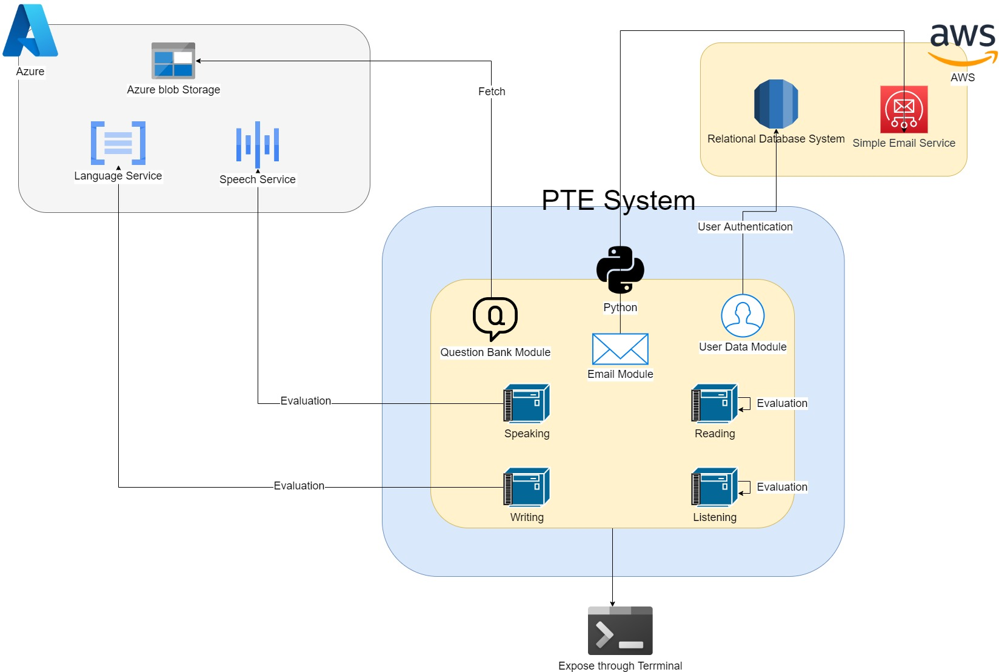
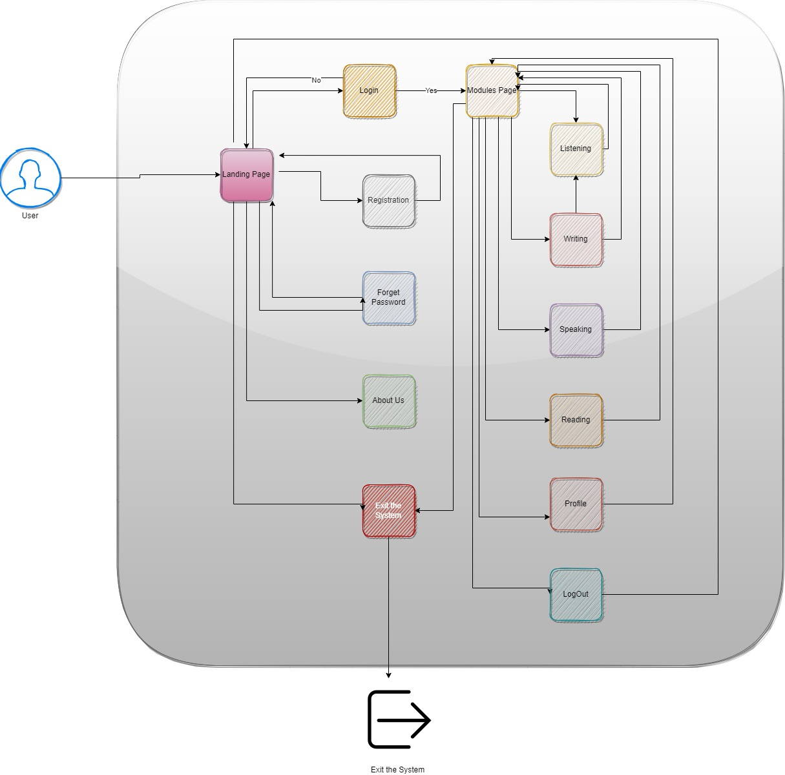
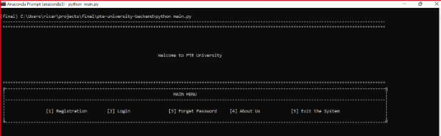

# pte-university-backend
This contains all the backend code for PTE University <br />

<hr />

## Content:
- [pte-university-backend](#pte-university-backend)
  - [Content:](#content)
  - [Authors:](#authors)
  - [Motivation:](#motivation)
  - [Code Architecture:](#code-architecture)
  - [Code Logic:](#code-logic)
  - [Prerequisites:](#prerequisites)
  - [Run:](#run)
  - [Proof of work:](#proof-of-work)

<hr />

## Authors:
1. Jamelah Guimba <br />
2. Ricardo Chacon <br />
3. Sulabh Shrestha <br />

<hr />

## Motivation:
Since many years ago, the English language has been an angular stone for people without caring about if the person is professional, technical skilled worker, student, or just a simple person looking to improve their language skill, and so on and this is because globalization has becoming to create opportunities across the borders. 

Additionally, pandemic has pushed new opportunities and open borders for professionals working remotely; however, many people still need to get prepared in the English language. Despite there being many options in the market, many of them are too expensive and unreachable for many, and furthermore, students need to be present in the place. 

Also exist some virtual option however, the price is still too high, but AI technology lets to develop tools to learn English and simulate tests as well as TOEFL and IELTS with lower costs 

 

<hr />

## Code Architecture:

<hr />

## Code Logic:

<hr />

## Prerequisites:

<p>Creation of Anaconda Environment and Installation of Essential Python Libraries</p>

```conda create --name aml1214```<br/>
```conda activate aml1214```<br />
```pip install -r requirements.txt```

<hr />

## Run:

```python main.py```

<hr />


## Proof of work:

<hr />
